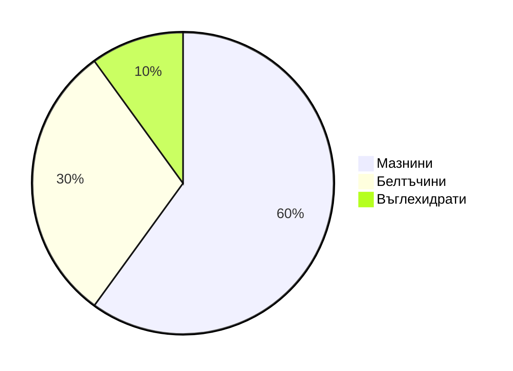
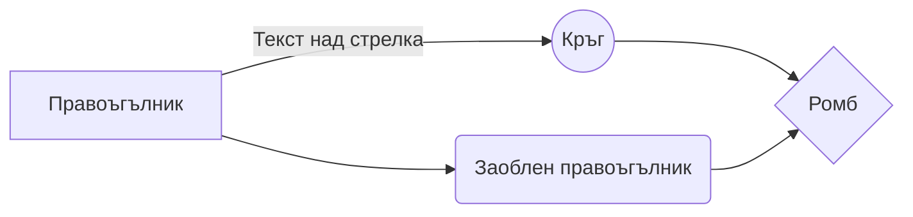

Markdown е език за форматиране на текст. Благодарение на него записките винаги изглеждат перфектно структурирани и галещи окото. Стига да спазвате някои елементарни правила, без много усилия, ще създавате съвършено изглеждаща документация. Голямо предимство на писането в Markdown формат е, че не ви е необходим специализиран софтуер. Достатъчно е да разполагате с най-обикновен текстов редактор и сте готови. Да! Дори и Notepad ви е достатъчен!😆

Форматирането ще представям първо като код, а след това крайният резултат до който води.

## Заглавия

```markdown
# Заглавие 1
## Заглавие 2
### Заглавие 3
#### Заглавие 4
##### Заглавие 5
```

# Заглавие 1

## Заглавие 2

### Заглавие 3

#### Заглавие 4

##### Заглавие 5

## Стил на текста

> За пример тук ще използвам на пръв поглед безсмисленото изречение: *Жълтата дюля беше щастлива, че пухът, който цъфна, замръзна като гьон*. Но това не е случайно. Такова изречение се нарича *панграма*, тъй като съдържа всички букви от българската азбука.
{: .prompt-info }

```markdown
### Удебелен шрифт

**Жълтата дюля беше щастлива, че пухът, който цъфна, замръзна като гьон.**

__Жълтата дюля беше щастлива, че пухът, който цъфна, замръзна като гьон.__

### Наклонен шрифт (курсив)

*Жълтата дюля беше щастлива, че пухът, който цъфна, замръзна като гьон.*

_Жълтата дюля беше щастлива, че пухът, който цъфна, замръзна като гьон._

### Удебелен и наклонен шрифт

***Жълтата дюля беше щастлива, че пухът, който цъфна, замръзна като гьон.***

___Жълтата дюля беше щастлива, че пухът, който цъфна, замръзна като гьон.___

```

### Удебелен шрифт

**Жълтата дюля беше щастлива, че пухът, който цъфна, замръзна като гьон.**

__Жълтата дюля беше щастлива, че пухът, който цъфна, замръзна като гьон.__

### Наклонен шрифт (курсив)

*Жълтата дюля беше щастлива, че пухът, който цъфна, замръзна като гьон.*

_Жълтата дюля беше щастлива, че пухът, който цъфна, замръзна като гьон._

### Удебелен и наклонен шрифт

***Жълтата дюля беше щастлива, че пухът, който цъфна, замръзна като гьон.***

___Жълтата дюля беше щастлива, че пухът, който цъфна, замръзна като гьон.___


## Блок за цитат

```markdown
> Жълтата дюля беше щастлива, че пухът, който цъфна, замръзна като гьон.
> Жълтата дюля беше щастлива, че пухът, който цъфна, замръзна като гьон.
>
> Жълтата дюля беше щастлива, че пухът, който цъфна, замръзна като гьон.
>
> Жълтата дюля беше щастлива, че пухът, който цъфна, замръзна като гьон.
> Жълтата дюля беше щастлива, че пухът, който цъфна, замръзна като гьон.
>> Жълтата дюля беше щастлива, че пухът, който цъфна, замръзна като гьон.
>>> Жълтата дюля беше щастлива, че пухът, който цъфна, замръзна като гьон.
```

> Жълтата дюля беше щастлива, че пухът, който цъфна, замръзна като гьон.
> Жълтата дюля беше щастлива, че пухът, който цъфна, замръзна като гьон.
>
> Жълтата дюля беше щастлива, че пухът, който цъфна, замръзна като гьон.
>
> Жълтата дюля беше щастлива, че пухът, който цъфна, замръзна като гьон.
> Жълтата дюля беше щастлива, че пухът, който цъфна, замръзна като гьон.
>> Жълтата дюля беше щастлива, че пухът, който цъфна, замръзна като гьон.
>>> Жълтата дюля беше щастлива, че пухът, който цъфна, замръзна като гьон.

## Задраскване на текст

```markdown
Задраскан текст

~~Жълтата дюля беше щастлива, че пухът, който цъфна, замръзна като гьон.~~
```

Задраскан текст

~~Жълтата дюля беше щастлива, че пухът, който цъфна, замръзна като гьон.~~

## Горен индекс

```markdown
2 <sup>53-1</sup> и -2 <sup>53-1</sup>
```

2 <sup>53-1</sup> и -2 <sup>53-1</sup>

## Долен индекс

```markdown
Долен индекс

<sub>Жълтата дюля беше щастлива, че пухът, който цъфна, замръзна като гьон.</sub>
```

Долен индекс
<sub>Жълтата дюля беше щастлива, че пухът, който цъфна, замръзна като гьон.</sub>

## Таблици

```markdown
| По подразбиране | Ляво подравняване | Центрирано | Дясно подравняване |
| --------------- |:------------------|:----------:|-------------------:|
| 9999999999      | 9999999999        | 9999999999 | 9999999999         |
| 999999999       | 999999999         | 999999999  | 999999999          |
| 99999999        | 99999999          | 99999999   | 99999999           |
| 9999999         | 9999999           | 9999999    | 9999999            |
```

| По подразбиране | Ляво подравняване | Центрирано | Дясно подравняване |
| --------------- |:------------------|:----------:|-------------------:|
| 9999999999      | 9999999999        | 9999999999 | 9999999999         |
| 999999999       | 999999999         | 999999999  | 999999999          |
| 99999999        | 99999999          | 99999999   | 99999999           |
| 9999999         | 9999999           | 9999999    | 9999999            |

## Линкове

```markdown
[Chatrix.One - Документация](https://docs.chatrix.one)
```

[Chatrix.One - Документация](https://docs.chatrix.one)

## Имейл адреси

```markdown
<justin.tester@nonexistent.mail>
```

<justin.tester@nonexistent.mail>

## Изображение

### От линк

```markdown

```

{: .shadow }
*Изображението се зарежда и визуализира от посочения линк.*

### Локално

```markdown

```


*Изображението се зарежда и визуализира от локално хранилище.*

## Списъци

```markdown
1. Едно
2. Две
3. Три
```

1. Едно
2. Две
3. Три

```markdown
1. Първо ниво
     1. Второ ниво
         - Трето ниво
             - Четвърто ниво
2. Първо ниво
     1. Второ ниво
3. Първо ниво
     1. Второ ниво
```

1. Първо ниво
     1. Второ ниво
         - Трето ниво
             - Четвърто ниво
2. Първо ниво
     1. Второ ниво
3. Първо ниво
     1. Второ ниво

```markdown
* 1
* 2
* 3

+ 1
+ 2
+ 3

- 1
- 2
- 3
```

* 1
* 2
* 3

+ 1
+ 2
+ 3

- 1
- 2
- 3

```markdown
- Първо ниво
     - Второ ниво
         - Трето ниво
             - Четвърто ниво
- Първо ниво
     - Второ ниво
- Първо ниво
     - Второ ниво
```

- Първо ниво
  - Второ ниво
    - Трето ниво
      - Четвърто ниво
- Първо ниво
  - Второ ниво
- Първо ниво
  - Второ ниво

```markdown
- [x] Череши 1кг
- [ ] Баклава 1/4кг
- [ ] Плащане на телефон
```

- [x] Череши 1кг
- [ ] Баклава 1/4кг
- [ ] Плащане на телефон

## Бутони, клавиши

```markdown
<kbd>Ctrl</kbd> + <kbd>Shift</kbd> + <kbd>P</kbd>
```

<kbd>Ctrl</kbd> + <kbd>Shift</kbd> + <kbd>P</kbd>

```markdown
<kbd> <br> Ctrl + Shift + P <br> </kbd>
```

<kbd> <br> Ctrl + Shift + P <br> </kbd>

## Хоризонтални линии

```markdown
## Хоризонтални линии

Вариант едно
___

Вариант две

* * *

Вариант три

___

```


*Без значение кой вариант ще изберете, резултатът ще бъде един и същ*

## Бележки под чертата

```markdown
Chatrix.One е сървър предлагащ комуникация, базирана на XMPP[^1] протокол.
Комуникацията е криптирана[^2] посредством OMEMO[^3].

[^1]: XMPP - Extensible Messaging and Presence Protocol;
[^2]: Известно още като шифроване;
[^3]: OMEMO представлява метод за двойно криптиране на комуникацията от край до край;
```

Chatrix.One е сървър предлагащ комуникация, базирана на XMPP[^1] протокол. Комуникацията е криптирана[^2] посредством OMEMO[^3].

[^1]: XMPP - Extensible Messaging and Presence Protocol;
[^2]: Известно още като шифроване;
[^3]: OMEMO представлява метод за двойно криптиране на комуникацията от край до край;

> Където и да поставите описанието в редактора, то винаги ще се визуализира в най-долната част на документа.
{: .prompt-info}

## Вграждане на код


*С цел правилно визуализиране, посоченият код е под формата на изображение.*

```python
# Brute force with a try-except block (Python 3+)
try:
    with open('/path/to/file', 'r') as fh:
        pass
except FileNotFoundError:
    pass

# Leverage the OS package (possible race condition)
import os
exists = os.path.isfile('/path/to/file')

# Wrap the path in an object for enhanced functionality
from pathlib import Path
config = Path('/path/to/file')
if config.is_file():
    pass
```

## Команди за изпълнение под терминал

```markdown
`cat /etc/os-release`
```

`cat /etc/os-release`

## Диаграми


*С цел правилно визуализиране, посоченият код е под формата на изображение.*



## Блок схема


*С цел правилно визуализиране, посоченият код е под формата на изображение.*



## Математически изрази

```markdown
Вграден (на реда) математически израз $x = {-b \pm \sqrt{b^2-4ac} \over 2a}$
```

Вграден (на реда) математически израз $x = {-b \pm \sqrt{b^2-4ac} \over 2a}$

```markdown
x = {-b \pm \sqrt{b^2-4ac} \over 2a}
```

$$
x = {-b \pm \sqrt{b^2-4ac} \over 2a}
$$

С тези знания можете да сътворите чудеса. Имайте предвид, че това далеч не е всичко, но за повечето хора е повече е достатъчно за създаването на една безупречно организирана документация.
