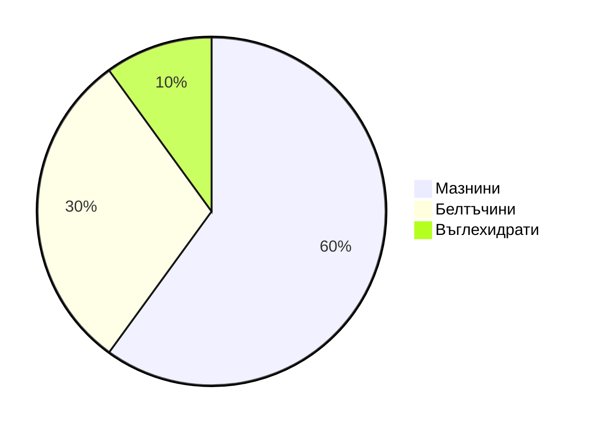

Markdown е език за форматиране на текст. Благодарение на него записките винаги изглеждат перфектно структурирани и галещи окото. Стига да спазвате някои елементарни правила, без много усилия, ще създавате съвършено изглеждаща документация. Голямо предимство на писането в Markdown формат е, че не ви е необходим специализиран софтуер. Достатъчно е да разполагате с най-обикновен текстов редактор и сте готови. Да! Дори и Notepad ви е достатъчен!😆

Форматирането ще представям първо като код, а след това крайният резултат до който води.

## Заглавия

```markdown
# Заглавие 1
## Заглавие 2
### Заглавие 3
#### Заглавие 4
##### Заглавие 5
```

# Заглавие 1

## Заглавие 2

### Заглавие 3

#### Заглавие 4

##### Заглавие 5

## Стил на текста

> За пример тук ще използвам на пръв поглед безсмисленото изречение: *Жълтата дюля беше щастлива, че пухът, който цъфна, замръзна като гьон*. Но това не е случайно. Такова изречение се нарича *панграма*, тъй като съдържа всички букви от българската азбука.
{: .prompt-info }

```markdown
Удебелен шрифт
**Жълтата дюля беше щастлива, че пухът, който цъфна, замръзна като гьон.**
__Жълтата дюля беше щастлива, че пухът, който цъфна, замръзна като гьон.__

Наклонен шрифт (курсив)
*Жълтата дюля беше щастлива, че пухът, който цъфна, замръзна като гьон.*
_Жълтата дюля беше щастлива, че пухът, който цъфна, замръзна като гьон._

Удебелен и наклонен шрифт
**_Жълтата дюля беше щастлива, че пухът, който цъфна, замръзна като гьон._**
```

### Удебелен шрифт

**Жълтата дюля беше щастлива, че пухът, който цъфна, замръзна като гьон.**
__Жълтата дюля беше щастлива, че пухът, който цъфна, замръзна като гьон.__

### Наклонен шрифт (курсив)

*Жълтата дюля беше щастлива, че пухът, който цъфна, замръзна като гьон.*
_Жълтата дюля беше щастлива, че пухът, който цъфна, замръзна като гьон._

### Удебелен и наклонен шрифт

**_Жълтата дюля беше щастлива, че пухът, който цъфна, замръзна като гьон._**

## Блок за цитат

```markdown
> Жълтата дюля беше щастлива, че пухът, който цъфна, замръзна като гьон.
> Жълтата дюля беше щастлива, че пухът, който цъфна, замръзна като гьон.
>
> Жълтата дюля беше щастлива, че пухът, който цъфна, замръзна като гьон.
>
> Жълтата дюля беше щастлива, че пухът, който цъфна, замръзна като гьон.
> Жълтата дюля беше щастлива, че пухът, който цъфна, замръзна като гьон.
>> Жълтата дюля беше щастлива, че пухът, който цъфна, замръзна като гьон.
>>> Жълтата дюля беше щастлива, че пухът, който цъфна, замръзна като гьон.
```

> Жълтата дюля беше щастлива, че пухът, който цъфна, замръзна като гьон.
> Жълтата дюля беше щастлива, че пухът, който цъфна, замръзна като гьон.
>
> Жълтата дюля беше щастлива, че пухът, който цъфна, замръзна като гьон.
>
> Жълтата дюля беше щастлива, че пухът, който цъфна, замръзна като гьон.
> Жълтата дюля беше щастлива, че пухът, който цъфна, замръзна като гьон.
>> Жълтата дюля беше щастлива, че пухът, който цъфна, замръзна като гьон.
>>> Жълтата дюля беше щастлива, че пухът, който цъфна, замръзна като гьон.

## Задраскване на текст

```markdown
Задраскан текст

~~Жълтата дюля беше щастлива, че пухът, който цъфна, замръзна като гьон.~~
```

Задраскан текст

~~Жълтата дюля беше щастлива, че пухът, който цъфна, замръзна като гьон.~~

## Горен индекс

```markdown
2 <sup>53-1</sup> и -2 <sup>53-1</sup> 
```

2 <sup>53-1</sup> и -2 <sup>53-1</sup> 

## Долен индекс

```markdown
Долен индекс

<sub>Жълтата дюля беше щастлива, че пухът, който цъфна, замръзна като гьон.</sub>
```

Долен индекс
<sub>Жълтата дюля беше щастлива, че пухът, който цъфна, замръзна като гьон.</sub>

## Таблици

```markdown
| По подразбиране | Ляво подравняване | Центрирано | Дясно подравняване |
| --------------- |:------------------|:----------:|-------------------:|
| 9999999999      | 9999999999        | 9999999999 | 9999999999         |
| 999999999       | 999999999         | 999999999  | 999999999          |
| 99999999        | 99999999          | 99999999   | 99999999           |
| 9999999         | 9999999           | 9999999    | 9999999            |
```

| По подразбиране | Ляво подравняване | Центрирано | Дясно подравняване |
| --------------- |:------------------|:----------:|-------------------:|
| 9999999999      | 9999999999        | 9999999999 | 9999999999         |
| 999999999       | 999999999         | 999999999  | 999999999          |
| 99999999        | 99999999          | 99999999   | 99999999           |
| 9999999         | 9999999           | 9999999    | 9999999            |

## Линкове

```markdown
[Chatrix.One - Документация](https://docs.chatrix.one)
```

[Chatrix.One - Документация](https://docs.chatrix.one)


## Изображение

```markdown

```


## Списъци

```markdown
1. Едно
2. Две
3. Три
```

1. Едно
2. Две
3. Три

```markdown
1. Първо ниво
     1. Второ ниво
         - Трето ниво
             - Четвърто ниво
2. Първо ниво
     1. Второ ниво
3. Първо ниво
     1. Второ ниво
```

1. Първо ниво
     1. Второ ниво
         - Трето ниво
             - Четвърто ниво
2. Първо ниво
     1. Второ ниво
3. Първо ниво
     1. Второ ниво

```markdown
* 1
* 2
* 3

+ 1
+ 2
+ 3

- 1
- 2
- 3
```

* 1
* 2
* 3

+ 1
+ 2
+ 3

- 1
- 2
- 3

```markdown
- Първо ниво
     - Второ ниво
         - Трето ниво
             - Четвърто ниво
- Първо ниво
     - Второ ниво
- Първо ниво
     - Второ ниво
```

- Първо ниво
  - Второ ниво
    - Трето ниво
      - Четвърто ниво
- Първо ниво
  - Второ ниво
- Първо ниво
  - Второ ниво

```markdown
- [x] Череши 1кг
- [ ] Баклава 1/4кг
- [ ] Плащане на телефон
```

- [x] Череши 1кг
- [ ] Баклава 1/4кг
- [ ] Плащане на телефон

## Бутони, клавиши

```markdown
<kbd>Ctrl</kbd> + <kbd>Shift</kbd> + <kbd>P</kbd>
```

<kbd>Ctrl</kbd> + <kbd>Shift</kbd> + <kbd>P</kbd>

```markdown
<kbd> <br> Ctrl + Shift + P <br> </kbd>
```

<kbd> <br> Ctrl + Shift + P <br> </kbd>

## Хоризонтални линии

```markdown
---
***
___
```

> Няма възможност да бъдат визуализирани тук. Но и в трите случая резултатът ще бъде един и същ.
{: .prompt-info }

## Вграждане на код

```markdown
def merge(*args, missing_val = None):
#missing_val will be used when one of the smaller lists is shorter tham the others.
#Get the maximum length within the smaller lists.
  max_length = max([len(lst) for lst in args])
  outList = []
  for i in range(max_length):
    result.append([args[k][i] if i < len(args[k]) else missing_val for k in range(len(args))])
  return outList
```

> Показаният по-горе код трябва да бъде включен в така наречения **code** блок. Това става, като за първи ред изпишете символите <kbd>`</kbd><kbd>`</kbd><kbd>`</kbd><kbd>p</kbd><kbd>y</kbd><kbd>t</kbd><kbd>h</kbd><kbd>o</kbd><kbd>n</kbd>, а за последен ред само <kbd>`</kbd><kbd>`</kbd><kbd>`</kbd>. Не поставяйте интервали между отделните символи!
{: .prompt-warning}
> Посоченият пример е за езика Python. На първия ред изписвайте името на използвания от вас език.
{: .prompt-tip}

```python
def merge(*args, missing_val = None):
#missing_val will be used when one of the smaller lists is shorter tham the others.
#Get the maximum length within the smaller lists.
  max_length = max([len(lst) for lst in args])
  outList = []
  for i in range(max_length):
    result.append([args[k][i] if i < len(args[k]) else missing_val for k in range(len(args))])
  return outList

```

## Команди от терминал

```markdown
`cat /etc/os-release`
```

`cat /etc/os-release`

## Диаграми

```markdown
pie
"Мазнини" : 60
"Белтъчини" : 30
"Въглехидрати" : 10
```

> Показаният по-горе код трябва да бъде включен в така наречения **mermaid** блок. Това става, като за първи ред изпишете символите <kbd>`</kbd><kbd>`</kbd><kbd>`</kbd><kbd>m</kbd><kbd>e</kbd><kbd>r</kbd><kbd>m</kbd><kbd>a</kbd><kbd>i</kbd><kbd>d</kbd>, а за последен ред само <kbd>`</kbd><kbd>`</kbd><kbd>`</kbd>. Не поставяйте интервали между отделните символи!
{: .prompt-warning}


```mermaid
pie
"Мазнини" : 60
"Белтъчини" : 30
"Въглехидрати" : 10
```

## Математически изрази

```markdown
Вграден (на реда) математически израз $x = {-b \pm \sqrt{b^2-4ac} \over 2a}$
```

Вграден (на реда) математически израз $x = {-b \pm \sqrt{b^2-4ac} \over 2a}$

```markdown
x = {-b \pm \sqrt{b^2-4ac} \over 2a}
```

$$
x = {-b \pm \sqrt{b^2-4ac} \over 2a}
$$

С тези знания можете да сътворите чудеса. Имайте предвид, че това далеч не е всичко, но за повечето хора е повече е достатъчно за създаването на една безупречно организирана документация.
